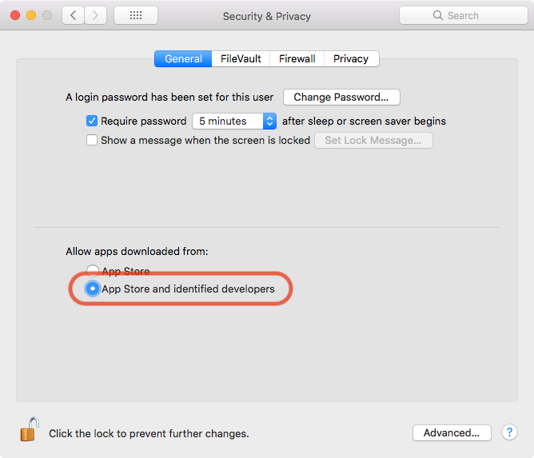
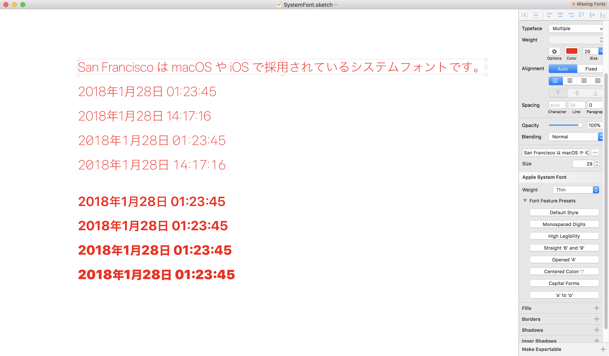
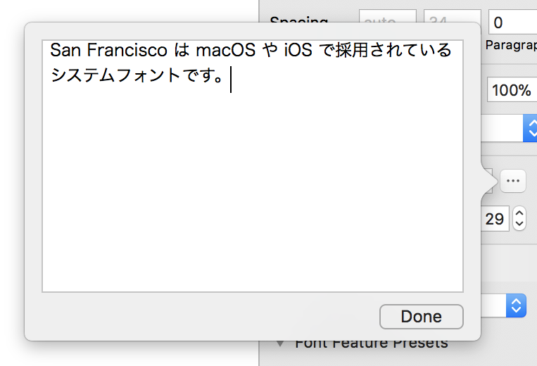

# Sketch Plugin “I Want Apple System Font”

## What's this ?

Sketchで選択したテキストレイヤーにAppleの「システムフォント」を適用します。

日本語文字を含むシステムフォントはSan FranciscoとHiragino Sansによる複合フォントで、見た目に違和感がないよう日本語の文字の大きさや文字間隔などに微調整が加えられています。日本語に適した禁則処理も行われます。これらの仕組みはフォントに“San Francisco”や“Hiragino Sans”を指定しても再現することができないため、macOSやiOSネイティブの見た目とは異なる描画結果となります。
Sketchには元々「システムフォント」を直接指定する方法が備わっていないので、このプラグインを導入することでmacOSやiOSのネイティブのテキストの見た目に近づけることが可能となります。

San Francisco／システムフォントの仕組みについてより詳しく知りたい方は次の記事をご覧ください。
> [San Francisco フォントを探る](https://qiita.com/usagimaru/items/da88c0a8793f23633c28)

## Requirements

- macOS 10.12 High Sierra
- Set Gatekeeper option: “App Store and identified developers”
- Sketch Version 48 and later

日本語環境で開発しているので、他の言語環境で正しく動作するか保証できません。
あくまでmacOSのシステムフォントを利用しているため、iOSのシステムフォントとは見た目等が異なる可能性があります。

### Set Gatekeeper Option

Allow apps that provided from identified developers on the Security & Privacy settings of System Preferences.

システム環境設定から「セキュリティとプライバシー」を開き、アプリケーションの実行許可を「App Storeと確認済みの開発元からのアプリケーションを許可」に変更してください。

More details: [https://support.apple.com/HT202491](https://support.apple.com/HT202491)

## Installation

1. Download [the latest version](https://github.com/usagimaru/Sketch-AppleSystemFont-Plugin/releases/latest).
2. Unzip the archive.
3. To install, double-click `sketchplugin` file or direct drag & drop to Sketch's Plugins directory.
4. Launch Sketch.app
5. Then you can see commands `Apple System Font` in Plugins menu.

--

1. [最新版をここからダウンロード](https://github.com/usagimaru/Sketch-AppleSystemFont-Plugin/releases/latest)してください。
2. それを解凍すると `sketchplugin` ファイルが出来上がります。
3. `sketchplugin` をダブルクリックするか、Sketchの Plugins ディレクトリーに直接放り込んでインストールしてください。
4. Skech.appを再起動します。
5. Pluginsメニューに `Apple System Font` メニューが見つかれば成功です。

## Usage

1. Select text layers.
2. Select weight on the inspector panel.

--

1. テキストレイヤーを選択します。
2. インスペクターから任意のウェイトを選択します。

## Keyboard Shortcuts

You can set any key bindings on System Preferences.

システム環境設定のキーボードショートカットで好きなキーの組み合わせを指定することができます。

## Screenshots

## Version History

### 0.1.0

18.01.28 JST

- 足りていなかったウェイトを追加：
	※ 20pt以上にのみ有効、SF Pro Textにこれらのウェイトが含まれないため。
	- Ultra Light
	- Thin
	- Black
- San FranciscoフォントのFeaturesに対応
	- Monospaced Digits
	- High Legibility
	- Open 4
	- Straight 6 and 9
	- 0 with Slash (High Legibility)
	- Centered Colon
	- Capital Forms
	- a to ɑ
- インスペクターUIを追加
	- Apple System Font
	- Typeface (Alternative)
- テキスト編集欄・ポップオーバー
- システムフォントを適用したレイヤーの “Typeface” パネルが使用不可能になってしまっていたが、無理やり使えるようにした
※ 副作用は未確認
- フォント適用時にCharacter SpacingとLine Heightをリセットするようにした

### 0.0.4

17.12.28 JST

メニューの整理。

### 0.0.3

17.12.25 JST

グループを選択した際にも再帰的にテキストレイヤーに対してまとめ設定を可能にした。

- システムフォントまとめ設定
- ロックレイヤーを適用対象から除外

### 0.0.2

17.12.24 JST

等幅数字に対応。

### 0.0.1

17.12.23 JST

最初の公開版。
次のウェイトを指定できます。

- Regular
- Light
- Medium
- Semibold
- Bold
- Heavy

## Copyright

© 2017 Satori Maru.

- Twitter: @usagimaruma
- GitHub: @usagimaru
- Qiita: @usagimaru
