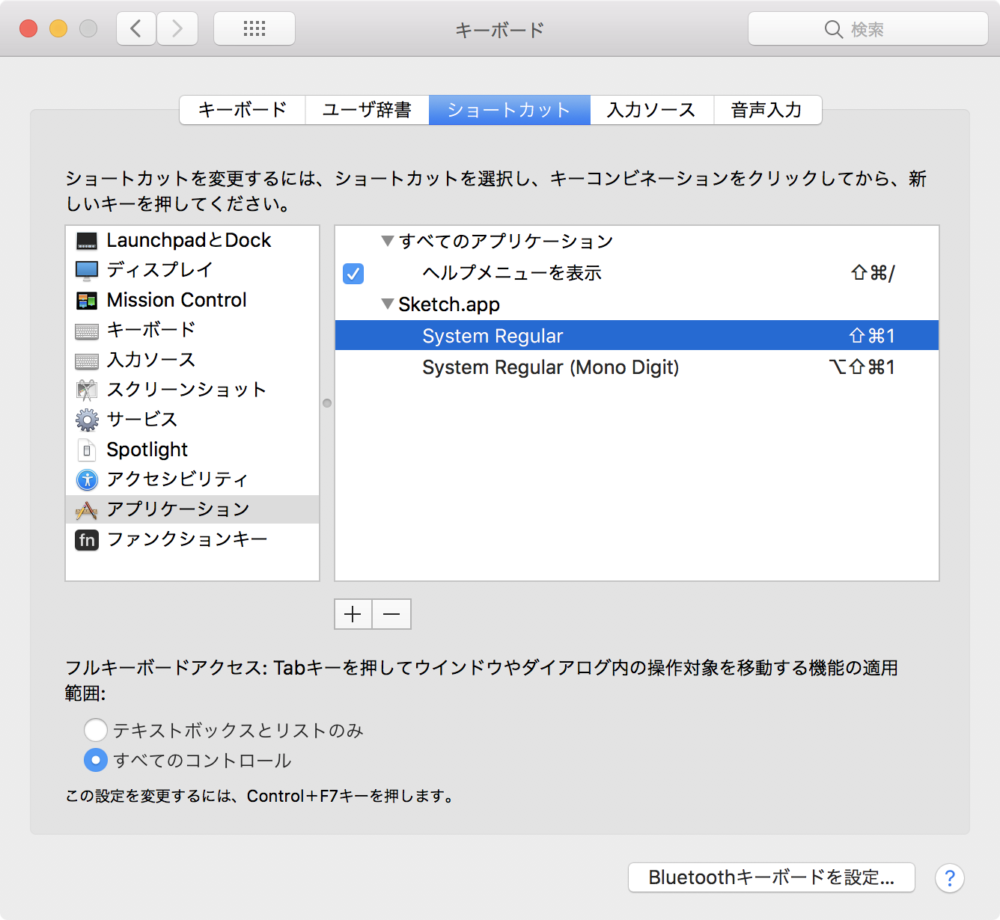

# Sketch Plugin “I Want Apple System Font”

## What's this ?

Sketchで選択したテキストレイヤーに、Appleの「システムフォント」を適用します。

「システムフォント」とはSan FranciscoとHiragino Sansによる複合フォントで、和欧混植で違和感がないよう日本語のグリフの大きさやカーニングに微調整が加えられています。フォントとしてSan Franciscoを指定してもそのメトリクスがmacOSやiOSの「システムフォント」とは異なるので、Sketch上で同じ見た目のテキストを再現することができません。Hiragino Sansを指定しても今度は欧文のグリフがSFではなくヒラギノになってしまいます。
残念ながらSketchには「システムフォント」を直接指定する方法が備わっていないので、このプラグインでその機能を拡張することにしました。

## Requirements

- macOS 10.12 High Sierra
- Sketch Version 48 and later

日本語環境で開発しているので、他の言語環境で正しく動作するか保証できません。10.11 Sierraでもおそらくは動くと思いますが、環境がないので動作を保証できません。

あくまでmacOSのシステムフォントを利用しているため、iOSのシステムフォントとは見た目等が異なる可能性があります。

## Installation

1. Download [the latest version](https://github.com/usagimaru/Sketch-AppleSystemFont-Plugin/releases/latest).
2. Unzip the archive.
3. To install, double-click `sketchplugin` file or direct drag & drop to Sketch's Plugins directory.
4. Launch Sketch.app
5. Then you can see commands `Set Apple System Font` in Plugins menu.

--

1. [最新版をここからダウンロード](https://github.com/usagimaru/Sketch-AppleSystemFont-Plugin/releases/latest)してください。
2. それを解凍すると `sketchplugin` ファイルが出来上がります。
3. `sketchplugin` をダブルクリックするか、Sketchの Plugins ディレクトリーに直接放り込んでインストールしてください。
4. Skech.appを再起動します。
5. Pluginsメニューに `Set Apple System Font` メニューが見つかれば成功です。

## Usage

1. Select text layers.
2. Run any commands of `Set Apple System Font` in Plugins menu.

--

1. テキストレイヤーを選択します。
2. Pluginsメニューの `Set Apple System Font` からコマンドを実行します。

## Keyboard Shortcuts

システム環境設定のキーボードショートカットで好きなキーの組み合わせを指定することができます。

## Version History

### 0.0.4

17.12.28 JST

メニューの整理。

### 0.0.3

17.12.25 JST

グループを選択した際にも再帰的にテキストレイヤーに対してまとめ設定を可能にした。

- システムフォントまとめ設定
- ロックレイヤーを適用対象から除外

### 0.0.2

17.12.24 JST

等幅数字に対応。

### 0.0.1

17.12.23 JST

最初の公開版。
次のウェイトを指定できます。

- Regular
- Light
- Medium
- Semibold
- Bold
- Heavy

## License

Under the [MIT](LICENSE).

## Author

- Twitter: @usagimaruma
- GitHub: @usagimaru
- Qiita: @usagimaru

© 2017 Satori Maru.
