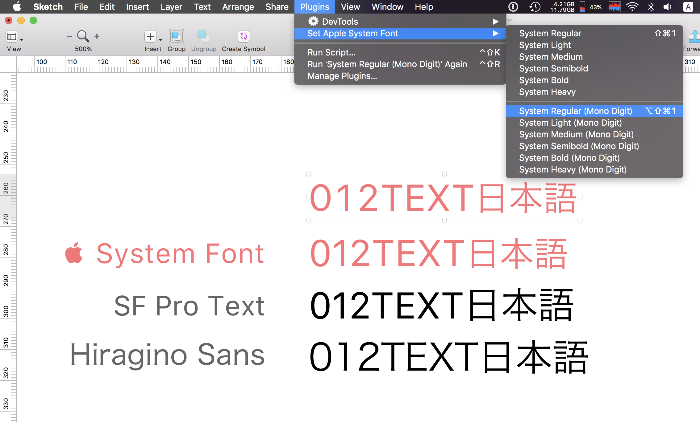
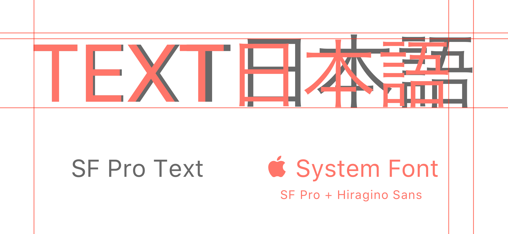

# I want Apple System Font

A Sketch plugin for applying Apple system font to text layers.

## What's this ?

Sketchで選択したテキストレイヤーに、Appleの「システムフォント」を適用します。

「システムフォント」とはSan FranciscoとHiragino Sansによる複合フォントで、日本語のグリフが少し小さく、カーニングにも微調整が加えられています。San Franciscoを指定してもメトリクスが異なるのでmacOSやiOSの「システムフォント」と同じ見た目のテキストを再現することができません。Hiragino Sansを指定しても今度は欧文のグリフがヒラギノになってしまいます。
残念ながらSketchには「システムフォント」を直接指定する方法が備わっていないので、このプラグインでその機能を拡張することにしました。

## Requirements

- macOS 10.12 High Sierra
- Sketch Version 48 and later

日本語環境で開発しているので、他の言語環境で正しく動作するか保証できません。
10.11 Sierraでもおそらくは動くと思いますが、環境がないので動作を保証できません。
あくまでmacOSの「システムフォント」を利用しているため、iOSのシステムフォントとは見た目等が異なる可能性があります。

## Installation

1. Download latest version.
2. Unzip the archive.
3. To install, double-click `sketchplugin` file or direct drag & drop to Sketch's Plugins directory.
4. Launch Sketch.app
5. Then you can see commands `Set Typeface to Apple System` in Plugins menu.

--

1. 最新版をここからダウンロードしてください。
2. それを解凍すると `sketchplugin` ファイルが出来上がります。
3. `sketchplugin` をダブルクリックするか、Sketchの Plugins ディレクトリーに直接放り込んでインストールしてください。
4. Skech.appを再起動します。
5. Pluginsメニューに `Set Typeface to Apple System` メニューが見つかれば成功です。

## Usage

1. Select text layers.
2. Run any commands of `Set Typeface to Apple System` in Plugins menu.

--

1. テキストレイヤーを選択します。
2. Pluginsメニューの `Set Typeface to Apple System` からコマンドを実行します。

## Shortcut Key

システム環境設定のキーボードショートカットで好きなキーの組み合わせを指定することができます。

## License

Under the [MIT](LICENSE).
